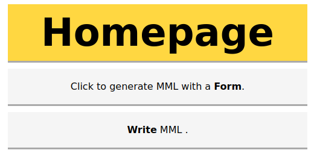
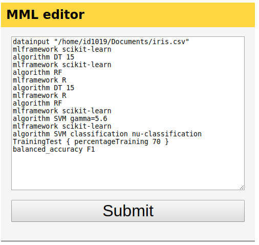
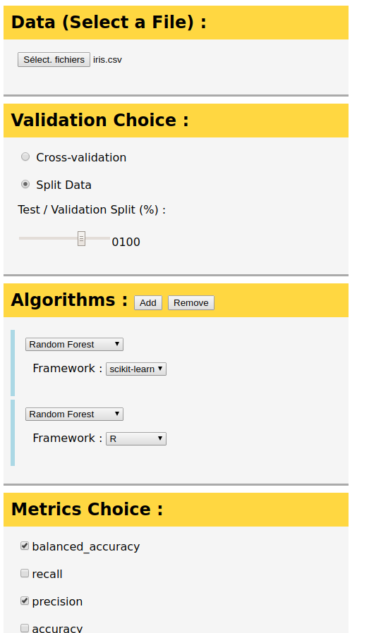
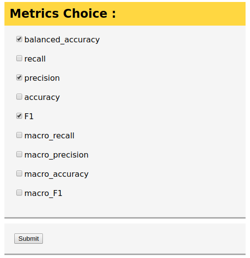
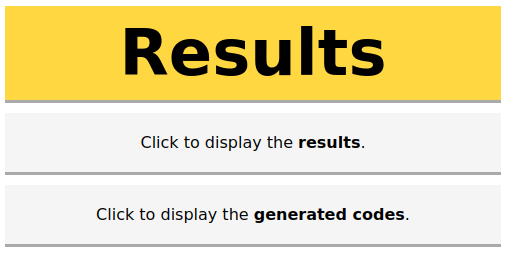
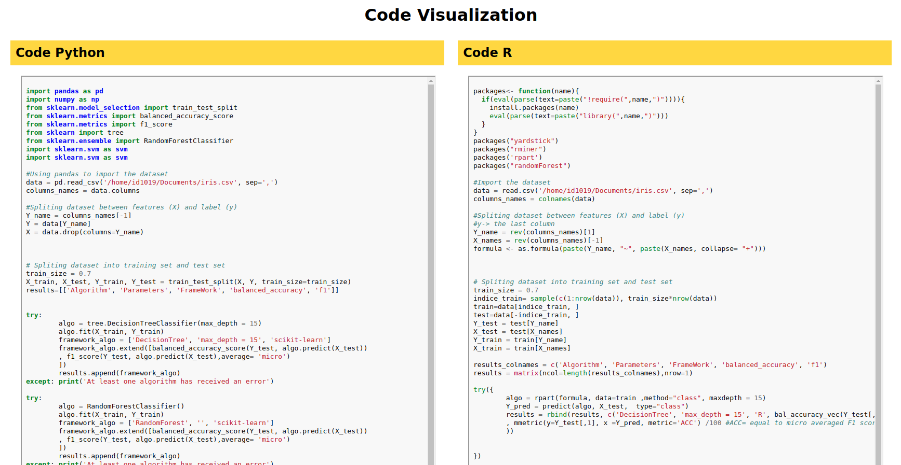
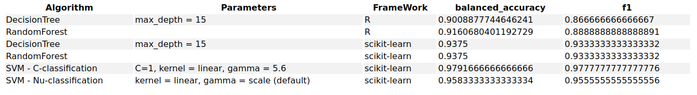

# MML-web application  

## Software engineering Project 

### Céline DUVAL - Renan BERNARD - Mathilde LETOUQ - Nadège CHOJNACKI - Elena MOROIANU 

## The context of this project:  

This project is the common theme of several classes aimed at introducing us to the world of web applications with back and front ends. The idea was to learn the skills required to create a web application through several practical sessions in order to later apply them to this project. Moreover, to connect this project to our other courses, we were asked to create a web application that would apply different classification algorithms to a data-set specified by the user. The user will choose algorithms he wants to use. And the application will return codes in selected languages if the user wants to execute by him-self these algorithms. Or the user can compare the algorithms on several criterions such as the accuracy of the model. 
 

## Man-Machine Language (MML) 

Man-machine language is a specification language. That means that it's a language used to create new languages. And this new language is often a standardised version of different languages.   

During our project, we created a MML language about machine learning. Indeed, many languages have their own machine learning algorithm. But each language has its own specification, implementation and vocabulary.  
 
Our goal is to create a new machine learning language. This new language will be easier to understand and easier to learn. Indeed, it is used only for machine learning purpose so the syntax is conceived exclusively for this.  

First, we tried to create our MML language. But, for the practical sessions and project, we used a language created by our teacher. We chose to implement two languages (R and the framework scikit-learn from Python) and five differents algorithms:  

* Decision Tree 

* Random Forest 

* SVM 

* Logistic Regression 

* XGBoost 

## Application Compilation

Between the configuration pages and the results pages, many things happen in the back-end. 

First, our application converts the form into mml language. The server can read the mml file. It will convert and exports the mml files into R and/or Python files then it compiles these files. When the application compiles the code, it also deletes former results files. 

Each R or Python files returns a csv file. It contains the name of the algorithm, its parameters, the framework and the results of the different metrics. After, the two csv are concatenated. This csv is parsed in java to create a html table for the visualisation of the results. 

For the visualisation of the Python and R code, we need a highlighted code. So, the server use pygment to convert our code into html page. And these two html pages are including in another html page with the right structure and style. 

## The website architecture:  
 
### Configuration pages:  

On the homepage, you can choose between two ways to define the parameters of our application: the editor or the form. 

For information, the **cross-validation in R is not implemented in our application**. 

 
#### Editor  

In this editor, you have to write your programme in our mml language. 

For the syntax, you can read the **mml_language.md** files. 

Formula was not implemented. Therefore our application considers that the last column is the predictive variable.

#### Form 

Unlike in the editor, here everything is easy. Indeed, you don't have to know our mml language you just have to click on the different buttons. Our application converts for you the form into a mml languages.

First, you can choose the files where you want to apply a machine learning algorithm. The interest variable is the last column of the csv files. 

After you can choose the algorithm, the language and the parameters you want. When the form is complete and good for you, you can submit it. 

### Results pages 

After submitting the form or the mml code, you arrive on an intermediate page. You will be able to choose between the visualisation of the code or the comparison of the algorithms.  

#### Code visualisation

In these pages, you can visualise the code created by our application with the parameters you chose in the first part. The code is highlight with the tool pygment. 

If you only chose R or Python algorithm, one of the sides will display an error but it's normal. 

#### The comparison of different algorithms

These pages contain a table with the performance of the different algorithms. So, you can compare the algorithms with the criterions you chose before.

## **We hope you will appreciate our web application!**
